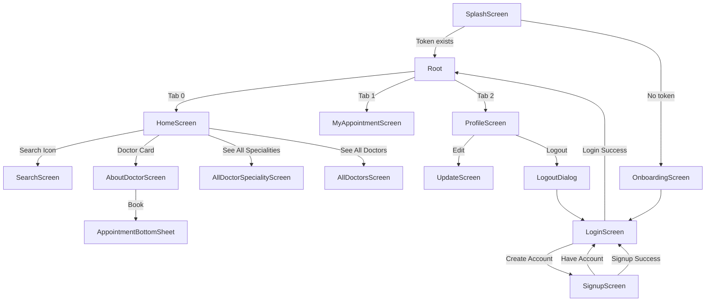

# 🩺 DocDoc — Doctor Appointment Booking App

A **Flutter** mobile application that lets patients browse doctors by speciality, search for specific doctors, book appointments, and manage their profile. Built with a **clean feature-based architecture**, **BLoC/Cubit** state management, and a **Dio** networking layer connected to a REST API.

---

## 📑 Table of Contents

- [Features Overview](#-features-overview)
- [Screenshots Flow](#-screenshots-flow)
- [Tech Stack & Packages](#-tech-stack--packages)
- [Architecture Overview](#-architecture-overview)
- [File Structure](#-file-structure)
- [Core Layer](#-core-layer)
- [Shared Widgets](#-shared-widgets)
- [Feature Modules](#-feature-modules)
- [State Management](#-state-management)
- [Networking Layer](#-networking-layer)
- [Navigation Flow](#-navigation-flow)
- [Data Models](#-data-models)
- [Local Storage](#-local-storage)
- [API Endpoints](#-api-endpoints)
- [Getting Started](#-getting-started)

---

## 🚀 Features Overview

| Feature | Description |
|---------|------------|
| **Onboarding** | Welcome screen shown on first launch |
| **Authentication** | Login & Sign-up with form validation, gender toggle, social sign-in placeholders |
| **Home** | Greeting banner, doctor specialities list, recommended doctors from API |
| **Doctor Search** | Real-time doctor search by name |
| **Doctor Details** | View full doctor profile, specialization, pricing, and working hours |
| **Appointment Booking** | Date picker + time picker → book appointment with optional notes |
| **My Appointments** | View all booked appointments with doctor info, status, and price |
| **Profile** | View/edit user data, logout |
| **Splash Screen** | Animated logo with auto-redirect based on auth status |

---

## 🗺️ Screenshots Flow

```
Splash Screen → (logged in?) → Root (Home / Appointments / Profile)
                 (not logged in?) → Onboarding → Login ↔ Sign Up
```

---

## 🛠️ Tech Stack & Packages

| Category | Package | Purpose |
|----------|---------|---------|
| **State Management** | `flutter_bloc` | Cubit-based state management |
| **Networking** | `dio` | HTTP client for REST API calls |
| **Local Storage** | `shared_preferences` | Persist auth token & login status |
| **Responsive** | `flutter_screenutil` | Adaptive sizing across screen sizes |
| **Typography** | `google_fonts` | Inter font family |
| **SVG** | `flutter_svg` | Render SVG icons |
| **Images** | `cached_network_image` | Cache network images for doctor photos |
| **Animations** | `lottie` | Lottie animation files |
| **Date Picker** | `easy_date_timeline` | Horizontal date picker for appointments |
| **Dialogs** | `awesome_dialog` | Pre-built dialog widgets |
| **Loading** | `skeletonizer` | Skeleton loading placeholders |
| **Text** | `auto_size_text` | Auto-sizing text widgets |
| **Layout** | `flutter_gap` | Convenience gap/spacing widget |
| **Toggle** | `toggle_switch` | Male/Female gender toggle |
| **URL** | `url_launcher` | Open external URLs |
| **Date Format** | `intl` | Date/time formatting |
| **Nav Bar** | `glaze_nav_bar` | Navigation bar (available, custom currently used) |
| **Dev Tool** | `device_preview` | Preview app on different device sizes |

---

## 🏗️ Architecture Overview

The project follows a **feature-based clean architecture** with three main layers:

```
lib/
├── core/          ← Shared infrastructure (network, models, constants, utils)
├── features/      ← Feature modules (each with data/screens/widgets)
├── shared/        ← Reusable UI widgets used across features
├── main.dart      ← App entry point, BLoC providers, theme
├── root.dart      ← Bottom navigation shell (Home, Appointments, Profile)
└── splash_screen.dart  ← Animated splash with auth redirect
```

### Each Feature Module follows this pattern:

```
feature_name/
├── data/
│   ├── model/          ← Data classes for API responses
│   ├── presentation/   ← Cubits & States (business logic)
│   └── repo/           ← Repository classes (API calls)
├── screens/            ← Full-page screen widgets
└── widgets/            ← Reusable widgets specific to this feature
```

> **Data flows:** `Screen` → listens to `Cubit` → calls `Repo` → uses `ApiService` → `DioClient` → REST API

---

## 📂 File Structure

```
lib/
│
├── main.dart                          # App entry, MultiBlocProvider, theme, ScreenUtilInit
├── root.dart                          # Bottom nav bar shell with 3 tabs
├── splash_screen.dart                 # Animated splash → Onboarding or Root
│
├── core/
│   ├── constant/
│   │   ├── app_colors.dart            # Color palette (kPrimary, kBackGround, semantic colors)
│   │   ├── app_strings.dart           # API base URL
│   │   └── screen_size.dart           # Screen dimension helpers
│   │
│   ├── models/
│   │   ├── doctor_model.dart          # Doctor data model with fromMap factory
│   │   ├── speciality_model.dart      # Speciality model + static speciality list
│   │   └── user_model.dart            # User data model with fromJson factory
│   │
│   ├── network/
│   │   ├── dio_client.dart            # Dio instance with base URL, auth interceptor
│   │   ├── api_service.dart           # CRUD helper (get, post, put, delete)
│   │   ├── api_error.dart             # Structured API error (field-level errors)
│   │   └── api_exceptions.dart        # DioException → ApiError converter
│   │
│   └── utils/
│       └── pref_helper.dart           # SharedPreferences wrapper (token, login, count)
│
├── shared/
│   ├── custom_button.dart             # Reusable button with gradient/border options
│   ├── custom_text.dart               # AutoSizeText wrapper with Inter font
│   ├── custom_text_form_field.dart    # Styled text input with validation
│   ├── custom_scaffold_messanger.dart # SnackBar helper
│   └── logo_docdoc.dart               # App logo widget
│
├── features/
│   ├── Onboarding/
│   │   └── screens/
│   │       └── onBoarding_screen.dart
│   │
│   ├── auth/
│   │   ├── data/
│   │   │   ├── presenation/
│   │   │   │   ├── auth_cubit.dart          # Login & signup logic
│   │   │   │   └── auth_state.dart          # AuthInitial/Loading/Success/Failed
│   │   │   └── repo/
│   │   │       └── auth_repo.dart           # POST /auth/register, /auth/login
│   │   ├── screens/
│   │   │   ├── login_screen.dart            # Login form with social sign-in
│   │   │   └── signup_screen.dart           # Sign-up form with gender toggle
│   │   └── widgets/
│   │       ├── custom_dialog_widget.dart     # Error dialog for API errors
│   │       └── custom_remember_forgot_password.dart
│   │
│   ├── home screen/
│   │   ├── data/
│   │   │   ├── model/
│   │   │   │   └── home_page_model.dart     # Grouped doctors by speciality
│   │   │   ├── presentation/
│   │   │   │   ├── home_cubit.dart          # Fetch home page data
│   │   │   │   ├── home_state.dart
│   │   │   │   ├── all_doctors_cubit.dart   # Fetch all doctors list
│   │   │   │   └── all_doctors_state.dart
│   │   │   └── repo/
│   │   │       └── home_repo.dart           # GET /home/index, /doctor/index
│   │   ├── screens/
│   │   │   ├── Home_screen.dart             # Main home with specialities + doctors
│   │   │   ├── about_doctor_screen.dart     # Doctor detail page
│   │   │   ├── all_doctor_speciality_screen.dart  # All specialities grid
│   │   │   └── all_doctors_screen.dart      # Full doctor listing
│   │   └── widgets/
│   │       ├── custom_doctor_card_widget.dart
│   │       ├── custom_speciality.dart
│   │       └── speciality_header_delegate.dart
│   │
│   ├── appointment/
│   │   ├── data/
│   │   │   ├── model/
│   │   │   │   ├── appointment_model.dart    # Appointment with doctor + patient
│   │   │   │   └── date_helper.dart          # Date formatting utilities
│   │   │   ├── presentation/
│   │   │   │   ├── appointment_cubit.dart    # Book & fetch appointments
│   │   │   │   └── appointment_state.dart
│   │   │   └── repo/
│   │   │       └── appointment_repo.dart     # POST /appointment/store, GET /index
│   │   ├── screen/
│   │   │   ├── my_appointment_screen.dart    # List of user's appointments
│   │   │   └── appointment_bottom_model_sheet.dart  # Booking bottom sheet
│   │   └── widget/
│   │       ├── appointmet_card.dart          # Single appointment card
│   │       └── custom_divider.dart
│   │
│   ├── search doctor/
│   │   ├── data/
│   │   │   ├── presentaion/
│   │   │   │   ├── search_doctor_cubit.dart  # Search doctor by name
│   │   │   │   └── search_doctor_state.dart
│   │   │   └── repo/
│   │   │       └── search_repo.dart
│   │   ├── screen/
│   │   │   └── search_screen.dart
│   │   └── widgets/
│   │       └── ...
│   │
│   ├── profile screen/
│   │   ├── data/
│   │   │   ├── presentation/
│   │   │   │   ├── get user cubit/
│   │   │   │   │   ├── get_user_cubit.dart   # Fetch & update user profile
│   │   │   │   │   └── get_user_state.dart
│   │   │   │   └── logout/
│   │   │   │       ├── logout_cubit.dart      # Logout, clear token
│   │   │   │       └── logout_state.dart
│   │   │   └── repo/
│   │   │       └── user_repo.dart             # GET /user/profile, POST /user/update, /auth/logout
│   │   ├── screens/
│   │   │   ├── profile_screen.dart
│   │   │   ├── update_screen.dart
│   │   │   └── logout_dialog.dart
│   │   └── widgets/
│   │       └── custom_list_tile.dart
│   │
│   └── about doctor/
│       ├── data/
│       ├── screens/
│       └── widgets/
│
└── assets/
    ├── images/         # PNG images (doctor avatars, banners)
    ├── icons/          # SVG icons (home, calendar, search, social)
    ├── speciality/     # Speciality illustrations (heart, brain, etc.)
    └── lottie/         # Lottie animation JSON files
```

---

## 🎨 Core Layer

### `AppColors` — Design Tokens
Centralized color palette used app-wide:

| Token | Hex | Usage |
|-------|-----|-------|
| `kPrimary` | `#247BFD` | Primary brand blue |
| `kBackGround` | `#F0F4FA` | Scaffold background |
| `kDarkText` | `#1A1D26` | Main text color |
| `kTextMuted` | `#94A3B8` | Secondary/hint text |
| `kGradientStart/End` | `#247BFD → #6DB3F2` | Button & banner gradients |
| `kSuccess` | `#22C55E` | Success states |
| `kError` | `#EF4444` | Error states |
| `kBorder` | `#E2E8F0` | Input & card borders |
| `kWhite` | `#FFFFFF` | Card backgrounds |

### `AppStrings` — Configuration
```dart
static const String apiURL = "https://vcare.integration25.com/api";
```

### `ScreenSize` — Helpers
Static methods wrapping `MediaQuery` to get current screen width and height.

---

## 🧩 Shared Widgets

Reusable widgets located in `lib/shared/` that are used across multiple features:

| Widget | File | Description |
|--------|------|-------------|
| `CustomText` | `custom_text.dart` | Wraps `AutoSizeText` with Inter font, configurable color, size, weight, alignment, maxLines |
| `CustomButton` | `custom_button.dart` | Animated button with gradient, border, shadow support. Supports `useGradient`, `borderColor`, `textColor` |
| `CustomTextFormField` | `custom_text_form_field.dart` | Styled text input with validation, obscure text toggle, keyboard type |
| `CustomScaffoldMessenger` | `custom_scaffold_messanger.dart` | Global snackbar helper for showing error/success messages |
| `LogoDocdoc` | `logo_docdoc.dart` | App logo SVG widget used in splash & auth screens |

### Usage Example — `CustomButton`:
```dart
CustomButton(
  text: "Login",
  useGradient: true,       // Blue gradient background
  onTap: () { /* ... */ },
)

CustomButton(
  text: "Create Account",
  backGroundColor: Colors.white,
  borderColor: AppColors.kPrimary,    // Outlined style
  textColor: AppColors.kPrimary,
  onTap: () { /* ... */ },
)
```

---

## 📦 Feature Modules

### 1. 🔐 Auth (Login & Sign Up)

| Layer | File | What it does |
|-------|------|-------------|
| **Cubit** | `auth_cubit.dart` | Holds form controllers, calls `AuthRepo`, emits `AuthLoading/Success/Failed` |
| **Repo** | `auth_repo.dart` | `POST /auth/register` and `POST /auth/login` |
| **Screens** | `login_screen.dart`, `signup_screen.dart` | Animated forms with `BlocConsumer`, social sign-in buttons |
| **Widgets** | `custom_dialog_widget.dart` | Shows field-level API errors (email, password, phone) in a dialog |

**Auth Flow:**
```
Login → AuthCubit.login() → AuthRepo.logIn() → API
  ↓ success: save token → PrefHelper.saveToken() → navigate to Root
  ↓ failure: show SnackBar with error message

Sign Up → AuthCubit.signUp() → AuthRepo.signUp() → API
  ↓ success: navigate to Login
  ↓ failure: show CustomDialogWidget with field errors
```

### 2. 🏠 Home Screen

| Layer | File | What it does |
|-------|------|-------------|
| **Cubit** | `home_cubit.dart` | Fetches home data (specialities + doctors grouped) |
| **Cubit** | `all_doctors_cubit.dart` | Fetches complete doctor list |
| **Repo** | `home_repo.dart` | `GET /home/index` and `GET /doctor/index` |
| **Screen** | `Home_screen.dart` | `CustomScrollView` with SliverAppBar, banner, speciality list, doctor cards |

**UI Sections:**
1. **Greeting Bar** — "Hi, {name} 👋" from `GetUserCubit`
2. **Banner** — Gradient card with "Book and schedule with nearest doctor"
3. **Speciality List** — Horizontal scroll of 10 specialities with icons
4. **Recommendation Doctors** — Vertical list of `CustomDoctorCardWidget`

### 3. 📅 Appointment

| Layer | File | What it does |
|-------|------|-------------|
| **Cubit** | `appointment_cubit.dart` | Date/time selection, booking, fetching appointments |
| **Repo** | `appointment_repo.dart` | `POST /appointment/store`, `GET /appointment/index` |
| **Screens** | `my_appointment_screen.dart` | Lists all appointments |
| **Screens** | `appointment_bottom_model_sheet.dart` | Bottom sheet with date/time picker + notes |

**Booking Flow:**
```
Doctor Detail → "Book" → Bottom Sheet (date + time + notes) →
  AppointmentCubit.postAppointment() → API → Success/Failure
```

### 4. 🔍 Search Doctor

| Layer | File | What it does |
|-------|------|-------------|
| **Cubit** | `search_doctor_cubit.dart` | Searches doctors by name |
| **Repo** | `search_repo.dart` | API search endpoint |
| **Screen** | `search_screen.dart` | Search field + results list |

### 5. 👤 Profile

| Layer | File | What it does |
|-------|------|-------------|
| **Cubit** | `get_user_cubit.dart` | Fetch and update user profile |
| **Cubit** | `logout_cubit.dart` | Logout → clear token → redirect to Login |
| **Repo** | `user_repo.dart` | `GET /user/profile`, `POST /user/update`, `POST /auth/logout` |
| **Screens** | `profile_screen.dart`, `update_screen.dart`, `logout_dialog.dart` |

### 6. 🎬 Onboarding

Single welcome screen shown only on first launch (before user logs in).

### 7. 🩺 About Doctor

Doctor detail screen showing full profile, specialization, degree, address, working hours, and appointment price.

---

## 🔄 State Management

The app uses **flutter_bloc** with the **Cubit** pattern (simpler alternative to full BLoC with events).

### All Cubits (registered in `main.dart`):

| Cubit | States | Responsibility |
|-------|--------|---------------|
| `AuthCubit` | `AuthInitial`, `AuthLoading`, `AuthSuccess`, `AuthFailed` | Login, sign-up, hold form controllers |
| `HomeCubit` | `HomeInitial`, `HomeLoading`, `HomeSuccess`, `HomeFailed` | Fetch home page data |
| `AllDoctorsCubit` | `AllDoctorsInitial`, `Loading`, `Success`, `Failed` | Fetch full doctors list |
| `AppointmentCubit` | `Initial`, `Loading`, `Success`, `GetSuccess`, `Failed`, `DateChanged` | Book & retrieve appointments, date/time state |
| `SearchDoctorCubit` | `Initial`, `Loading`, `Success`, `Failed` | Search doctors by name |
| `GetUserCubit` | `Initial`, `Loading`, `Success`, `Failed` | Fetch & update user profile |
| `LogoutCubit` | `Initial`, `Loading`, `Success`, `Failed` | Logout, clear local data |

### State Pattern per Cubit:
```dart
// Every cubit follows this sealed-class pattern:
sealed class ExampleState {}
class ExampleInitial extends ExampleState {}
class ExampleLoading extends ExampleState {}
class ExampleSuccess extends ExampleState { final data; }
class ExampleFailed  extends ExampleState { final String errorMessage; }
```

### How Screens Consume States:
```dart
BlocConsumer<HomeCubit, HomeState>(
  listener: (context, state) {
    // Side effects (navigation, snackbars)
  },
  builder: (context, state) {
    // UI rendering based on state
    return Skeletonizer(
      enabled: state is HomeLoading,  // Show skeleton while loading
      child: /* actual content */,
    );
  },
)
```

---

## 🌐 Networking Layer

### `DioClient` (`core/network/dio_client.dart`)
Central HTTP client with:
- **Base URL** set from `AppStrings.apiURL`
- **Auth Interceptor** — automatically attaches `Bearer {token}` from SharedPreferences
- **Log Interceptor** — prints request/response for debugging

### `ApiService` (`core/network/api_service.dart`)
CRUD wrapper around Dio:
```dart
class ApiService {
  Future<dynamic> get(String endpoint)
  Future<dynamic> post(String endpoint, dynamic body)
  Future<dynamic> put(String endpoint, Map body)
  Future<dynamic> delete(String endpoint, Map body)
}
```

### Error Handling
```
DioException → ApiExceptions.handleError() → throws ApiError
                                                 ↓
                                         ApiError {
                                           statusCode, message,
                                           nameError, emailError,
                                           phoneError, genderError,
                                           passwordError
                                         }
```
- `ApiExceptions`: Catches `DioException`, checks if response is JSON or HTML, returns structured `ApiError`
- `ApiError`: Parses field-level validation errors from the API's `data` object
- Cubits catch `ApiError` and emit failure states with the error info

---

## 🧭 Navigation Flow



### Root Bottom Navigation:
| Index | Tab | Screen |
|-------|-----|--------|
| 0 | 🏠 Home | `HomeScreen` |
| 1 | 📅 Appointments | `MyAppointmentScreen` (with badge count) |
| 2 | ⚙️ Profile | `ProfileScreen` |

---

## 📊 Data Models

### `DoctorModel`
```dart
class DoctorModel {
  int doctorId;
  String name, email, phone, photo, gender;
  String address, description, degree;
  SpecialityModel specialization;
  int appointPrice;
  String startTime, endTime;
}
```

### `SpecialityModel`
```dart
class SpecialityModel {
  int specialityID;
  String? specialityImage;
  String specialityName;
  // Includes static list of 10 specialities with local assets
}
```

### `UserModel`
```dart
class UserModel {
  int id;
  String name, email, phone, gender;
}
```

### `AppointmentModel`
```dart
class AppointmentModel {
  int id;
  DoctorModel doctor;
  UserModel patient;
  String appointmentTime, appointmentEndTime;
  String status, notes;
  int appointmentPrice;
}
```

### `HomePageModel`
Groups doctors by speciality — returned from `/home/index`.

---

## 💾 Local Storage

`PrefHelper` (`core/utils/pref_helper.dart`) wraps `SharedPreferences`:

| Method | Key | Description |
|--------|-----|-------------|
| `saveToken(String?)` | `auth_token` | Store or remove JWT |
| `getToken()` | `auth_token` | Retrieve stored JWT |
| `clearToken()` | `auth_token` | Remove JWT |
| `saveLogged(bool)` | `isLogged` | Mark login status |
| `isLogged()` | `isLogged` | Check if user was logged in |
| `saveAppointmentCount(int)` | `appCount` | Cache appointment badge count |
| `getAppointmentCount()` | `appCount` | Retrieve cached count |

---

## 🔌 API Endpoints

**Base URL:** `https://vcare.integration25.com/api`

| Method | Endpoint | Used By | Description |
|--------|----------|---------|-------------|
| POST | `/auth/register` | `AuthRepo` | Create new account |
| POST | `/auth/login` | `AuthRepo` | Login, returns token |
| POST | `/auth/logout` | `ProfileRepo` | Logout |
| GET | `/home/index` | `HomeRepo` | Home page doctors grouped by speciality |
| GET | `/doctor/index` | `HomeRepo` | All doctors list |
| POST | `/appointment/store` | `AppointmentRepo` | Book new appointment |
| GET | `/appointment/index` | `AppointmentRepo` | User's appointments |
| GET | `/user/profile` | `ProfileRepo` | Get user profile |
| POST | `/user/update` | `ProfileRepo` | Update user data |

All requests include `Authorization: Bearer {token}` header via the Dio interceptor.

---

## 🚀 Getting Started

### Prerequisites
- Flutter SDK `^3.10.0`
- Dart SDK (bundled with Flutter)
- Android Studio / VS Code with Flutter extension
- An Android emulator or physical device

### Setup

```bash
# 1. Clone the repository
git clone <repository-url>
cd appointment

# 2. Install dependencies
flutter pub get

# 3. Run the app
flutter run
```

### Build APK

```bash
flutter build apk --release
```

### Project Configuration

- **Design Size:** `360 × 690` (set in `ScreenUtilInit` in `main.dart`)
- **Font:** Inter (via Google Fonts)
- **Min SDK:** Set in `android/app/build.gradle`

---

## 🧠 Key Concepts for New Developers

1. **Adding a new feature?** Create a folder under `lib/features/` with `data/`, `screens/`, and `widgets/` sub-folders. Put your Cubit in `data/presentation/`, your repo in `data/repo/`, and register the Cubit in `main.dart`'s `MultiBlocProvider`.

2. **Adding a new API call?** Use `ApiService` (get/post/put/delete), handle errors with `try/catch` and `ApiExceptions.handleError()`, and return parsed models.

3. **Adding a new shared widget?** Put it in `lib/shared/` and use the existing pattern (accept customization via constructor parameters).

4. **Need to persist data locally?** Add methods to `PrefHelper` using `SharedPreferences`.

5. **Color/styling changes?** Update `AppColors` constants and the theme in `main.dart`.

---

## 📝 Notes

- `DevicePreview` is enabled in debug mode for testing different screen sizes
- The app uses `Navigator.pushReplacement` for auth flows to prevent back-navigation
- Loading states are displayed using `Skeletonizer` (skeleton placeholders) and `CupertinoActivityIndicator`
- All text uses the custom `CustomText` widget wrapping `AutoSizeText` for consistent typography
- The bottom nav bar has an animated badge counter on the Appointments tab
